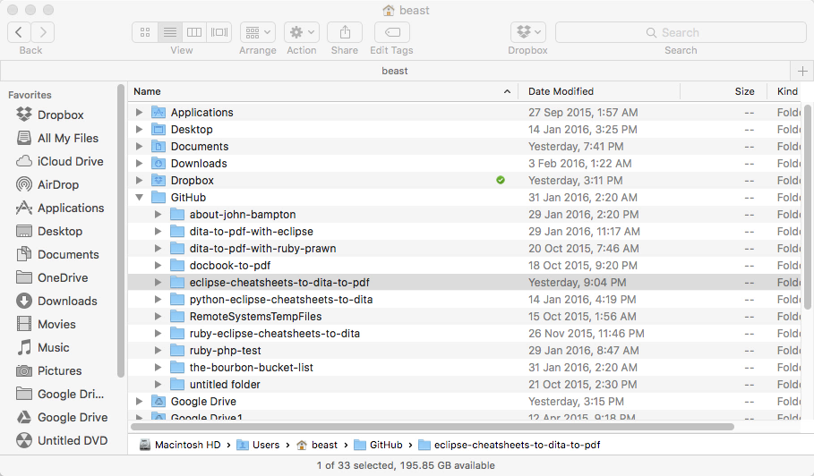

#Eclipse cheat sheets to DITA to PDF

I worked on the open source Java based project [Debrief](http://debrief.info/) the leading maritime analysis tool which is also on GitHub at [https://github.com/debrief/debrief](https://github.com/debrief/debrief). This project is based on some parts of the document publishing that I did in that project.  See the glossary of links at the bottom of this README which describe the technologies being used.

Note: Now supporting multiple output formats - PDF, HTMLHelp, TocJS, XHTML.

This program runs inside Eclipse, an integrated development environment (IDE) and is mainly a Java based project in that all the code libraries use Java (Apache FOP, Saxon, DITA Open Toolkit, Apache ANT, Eclipse) and it also uses XSL and XML heavily. Using Eclipse allows use to create a publishing pipeline creating all the working output formats one after the other, in one click by building the project.   Development was originally done in oXygen XML Editor then ported to Eclipse. 

The roadmap for this project is make the "info.debrief" custom DITA-OT plugin compatible with DITA-OT 2.1 and with the full Apache ANT build code and in depth instructions on how to get up and running inside Eclipse and more.... 

When built and run this project takes a set of Eclipse cheat sheets and transforms them to PDF.  Eclipse cheat sheets are obviously best viewed inside Eclipse.  Using PDF allows us to print nicely formated cheat sheets on paper which allows the user to work through the cheat sheets with a pen and check off each item as they go.  Using cheat sheets physically on paper was seen as a new way to learn and was the original concept of the Debrief cheat sheets publishing project I worked on.

Darwin Information Typing Architecture (DITA) is an XML data model for authoring and using DITA-OT you can publish those ideas. The DITA standard is maintained by the OASIS DITA Technical Committee.  Some of the largest and most successful companies in the world use DITA. [Companies using DITA](http://www.ditawriter.com/companies-using-dita/)

It's a two step process first the DITA XML is created from the Eclipse cheat sheets (XML files) and then you use the DITA-Open Toolkit to create the PDF from the auto created DITA files.

The two parts of the transformation and rendering comprise of:

1.	- This is the transformation step and it uses cheatsheet-to-dita.xsl which requires an XSLT 2.0 compliant processor.
	- I used SaxonHE9-6-0-7J from Saxonica.
	- This file takes as input a collection on XML files (Eclipse cheat sheets) and creates multiple output files - a parent DITA Map and some associated tasks.
	- The 'output/debrief' and sub 'dita' folder contains the dynamically created (transformed) DITA files from this step. 
	
	
2.	- This is the rendering (printing) step and the 'info.debrief' custom DITA-OT plugin produces the PDF via the DITA-OT base libraries and a XSL - Formatting Objects Processor (FO Processor)
	- The 'output/debrief/pdf' folder contains the resulting PDF output from this step
	- I used Apache FOP 2.0 for the FO Processor and DITA-OT 1.8.5

##Yo let's build...watch the Star Wars build run on Youtube....BrisVegas Jedi Master Style...

[See the build run full screen in 1080p](https://youtu.be/LJ5DsFP_THo)

##Build Instructions - Mac OS X

###Install Eclipse

Go to: [Eclipse Downloads](https://www.eclipse.org/downloads/?osType=macosx)

In the box near top labelled "Try the Eclipse Installer", click on "64 bit" under "Mac OS X".

Download Eclipse installer application.

You should check the checksum of the Eclipse file you download.

Depending on which type of checksum you choose: MD5, SHA1, SHA-512 the commands are slightly different:

First you should click on the checksum type in the image below:

On OS X, open your Applications folder, then open the Utilities folder. Open the Terminal application.

I used SHA-512 so the in a terminal in the directory or folder where you downloaded the Eclipse package to, the command to type would be:

###shasum -a 512 eclipse-inst-mac64.tar.gz

You should check the output of the shasum command matches what's displayed on the Eclipse website for the type of checksum you choose.  You can select the text in the terminal and then copy it and then find it on the Eclipse website.

For more information on the shasum or md5 command open a terminal and type:

####man shasum  

####man md5

Use the up and down arrows on the keyboard to navigate through the man page documentation.

To exit from the man pages type: q

Unzip resulting download (eclipse-inst-mac64.tar.gz) by double-clicking on it if downloader did not already unzip it.

Run "Eclipse Installer" application.

Choose "Eclipse IDE for Java Developers" option. (Other options and Eclipse modules are not necessary for this build.)

This option allows you to specify an "Installation Folder." The default option may be a folder within your individual directory.

It will be more useful to change this and install Eclipse within a directory titled "Eclipse" within the system's main Application directory.

Click on the folder icon to navigate to the Applications directory and create an "Eclipse" target sub-directory before installing.

Then click the "Install" button. The installation process may take a few minutes.

Launch Eclipse for the first time. Doing so will ask you to Select a "workspace." The default option "/Users/[your username]/Documents/workspace" will work fine.

Quit Eclipse for now.

###Install GitHub Desktop

The build's repository is found within GitHub, and the "GitHub Desktop for Mac" application will allow you to clone and work on the build more easily, while retaining a link to the primary source and thus obtaining updates and having the option to submit modifications which could be candidates for inclusion.

Go to: [GitHub Desktop](https://desktop.github.com/)

Click on the "Download GitHub Desktop" button.

Unzip the resulting file: GitHub Desktop 216.zip

This expands to: GitHub Desktop

Move this to your system's Applications directory.

###Clone the project to your desktop computer

Go to the GitHub repository for this project:

[https://github.com/jbampton/eclipse-cheatsheets-to-dita-to-pdf](https://github.com/jbampton/eclipse-cheatsheets-to-dita-to-pdf)

Click on the the icon just to left of 'Download ZIP' that when the mouse is over says: 'Save jbampton/eclipse-cheatsheets-to-dita-to-pdf to your computer and use in GitHub Desktop'

You will be presented with a dialog box that will ask you if open want to open the link with GitHub Desktop.  The dialog box will look different depending on which web browser you are using.  Below are what the dialog boxes look like:

Google Chrome

You will need to click launch application.

Firefox

You will need to select GitHub Desktop then click OK

In the "Clone As:" dialog box, accept the default option, which is to create a clone with the same name as the original: eclipse-cheatsheets-to-dita-to-pdf

Click the "Clone" button.

You will see a progress bar indicate the progress of files being downloaded from GitHub onto your desktop computer, into a local repository directory.

Quit GitHub Desktop.

###Import project into Eclipse

Launch Eclipse.

In menu bar, choose: File > Import 

Then > General > Existing Projects into Workspace -> click Next

You will be presented with the next dialog

Click 'Browse' next to 'Select root directory'

Navigate to the "eclipse-cheatsheets-to-dita-to-pdf" project, which (by default) should be within the "Users/[your user name]/GitHub" directory (or wherever you put it when you cloned it to your desktop).

This will bring the project into Eclipse.

If you have not already done so, click on the "Workspace" button so that you can view the project.

You must add the JAR files from SaxonHE and DITA-OT to Ant inside Eclipse. Go Eclipse -> Preferences

Then -> Ant -> Runtime -> Classpath tab -> click Global Entries

Then -> click Add JARs - you will be presented with the next dialog

Then-> Expand 'eclipse-cheatsheets-to-dita-to-pdf' and navigate to "src/libs/DITA-OT1.8.5/lib" and add all the JAR files from that directory.  Click add JARS again and add saxon9he.jar from  "src/libs/SaxonHE9-6-0-7J".  Make sure to click Apply and then click Ok.
		
	
Right click on build.xml and select -> Run As -> Ant Build -> (first one)

This should run and build all tasks, creating all working output formats in one go.

This process re-creates the DITA XML output in the 'output' directory.  There should be five DITA files, one parent Ditamap at and 4 task files with the Ditamap at the root of the 'output/debrief' folder with task files together in the sub folder 'dita'

The final resulting PDF should be called map.pdf and located in the 'pdf' folder.

There are currently 4 other output formats (Docbook, HTMLHelp, TocJS, XHTML) as seen by the names of the folders in the 'output/debrief' directory.  The PDF output is vastly superior to the others which have no customization.  The Docbook output is a work in progress. 

If you want to choose which output formats to render, you can right click on build.xml and select -> Run As -> Ant Build -> (second one). 

Then select which output format you would like on the 'Targets' tab under 'Check targets to execute' and click Run

	
##How DITA-OT PDF Plugins work:

Plugins are placed in the DITA-OT plugins directory.  You can see the plugin I built in this directory named 'info.debrief'.

When ready a plugin must be integrated into DITA-OT using Apache Ant.  I built this project using OS X and I installed Ant through Homebrew.  
 
On the command line from inside the root DITA-OT folder it would be -> ant -f integrator.xml

You can also run the integrator inside Eclipse as an Ant build by right clicking on 'src/libs/DITA-OT1.8.5/integrator.xml' and selecting -> Run As -> Ant Build (first one) and this should integrate the plugin with the toolkit.

Every DITA-OT PDF plugin has a file name plugin.xml at its root where you set the configuration values. The plugin id must match the folder name of the plugin.  Every plugin has a 'transtype' -> this plugins transtype is 'debrief'.  You can see the plugin.xml file and where to set the plugin id and transtype in the next image:

PDF Plugins are comprised of some XML config files, some artwork and some custom XSL (XSLT/XSL-FO/XPath) code 
DITA-OT provides that base XSL code that you 'override' with your custom work.

The two main files that configure plugins are plugin.xml and integrator.xml which should be in the root of the plugin folder.  The 'cfg' folder contains the rest of the customization.

Custom XSL can be placed in two XSL files both named custom.xsl.  I placed all the custom code at 'src/libs/DITA-OT1.8.5/plugins/info.debrief/cfg/fo/xsl/custom.xsl' for this project.  The other file is seen in the adjacent 'attrs' directory. 
 
 
 
Placing the custom code only in these two files follows best practice techniques on how to build a DITA-OT PDF plugin.

##Homebrew usage

Open a terminal and type:

###man brew

Before using Homebrew you should ensure it's up to date so run the next command:

###brew doctor

###Example output of running a brew install command.  The image show pouring brews from their bottles

###brew list

##List of resources and technologies used on this GitHub project	

Eclipse - https://eclipse.org/ 

Eclipse cheat sheets - http://help.eclipse.org/mars/index.jsp?topic=%2Forg.eclipse.platform.doc.user%2Freference%2Fref-cheatsheets.htm

The Apache Software Foundation - http://www.apache.org/

Apache FOP - https://xmlgraphics.apache.org/fop/

Apache ANT - http://ant.apache.org

Saxon XSLT - https://en.wikipedia.org/wiki/Saxon_XSLT

Saxon - http://saxon.sourceforge.net/

Saxonica - http://www.saxonica.com/welcome/welcome.xml

Online community for the Darwin Information Typing Architecture OASIS Standard - http://dita.xml.org/

DITA - https://en.wikipedia.org/wiki/Darwin_Information_Typing_Architecture

DITA-Open Toolkit - http://www.dita-ot.org/

W3C - The Extensible Stylesheet Language Family (XSL) - http://www.w3.org/Style/XSL/

W3C XSLT 2.0 - http://www.w3.org/TR/xslt20/ 

XSL Formatting Objects - https://en.wikipedia.org/wiki/XSL_Formatting_Objects

XSL-FO Processors - http://www.w3.org/community/ppl/wiki/XSL-FO_Processors

XML - https://en.wikipedia.org/wiki/XML

Adobe PDF - https://en.wikipedia.org/wiki/Portable_Document_Format

XHTML - https://en.wikipedia.org/wiki/XHTML

Dublin Core Metadata Initiative - http://dublincore.org/

Microsoft HTML Help 1.4 - https://msdn.microsoft.com/en-us/library/windows/desktop/ms670169(v=vs.85).aspx

The Organization for the Advancement of Structured Information Standards (OASIS) - https://en.wikipedia.org/wiki/OASIS_(organization)

oXygen XML Editor - http://www.oxygenxml.com

DITA to TocJS - http://www.dita-ot.org/1.8/readme/dita2tocjs.html

DITA-OT installing plugins - http://dita-ot.sourceforge.net/1.7/dev_ref/plugins-installing.html

Generate sample DITA-OT plugin - https://dita-generator-hrd.appspot.com/pdf-plugin/

Creating DITA-OT plugins - http://dita-ot.sourceforge.net/1.5.4/dev_ref/plugins-overview.html

Customizing PDF output - http://www.dita-ot.org/1.8/readme/dita2pdf-customization.html

XSLT FAQ. Docbook FAQ. Braille. - http://www.dpawson.co.uk/

Homebrew — The missing package manager for OS X - http://brew.sh/ 

Install Ant with Homebrew - http://brewformulas.org/Ant

Installing Apache Ant - http://ant.apache.org/manual/install.html

Codecademy - Learn the Command Line - https://www.codecademy.com/courses/learn-the-command-line

Codecademy - Learn Java - https://www.codecademy.com/learn/learn-java

Got 15 minutes and want to learn Git? https://try.github.io/levels/1/challenges/1

Ruby regular expression editor - http://rubular.com/

Essential programmer training - http://www.codewars.com/

Mastering Markdown - https://guides.github.com/features/mastering-markdown/

GitHub Desktop - https://desktop.github.com/

Microsoft File Checksum Integrity Verifier - https://www.microsoft.com/en-au/download/details.aspx?id=11533

TechSmith Camtasia - https://www.techsmith.com/camtasia.html

MD5 - https://en.wikipedia.org/wiki/MD5

sha1sum - https://en.wikipedia.org/wiki/Sha1sum

IDE - Integrated Development Environment - https://en.wikipedia.org/wiki/Integrated_development_environment

Git (software) - https://en.wikipedia.org/wiki/Git_(software)

man page - https://en.wikipedia.org/wiki/Man_page

Terminal (OS X) - https://en.wikipedia.org/wiki/Terminal_(OS_X)
